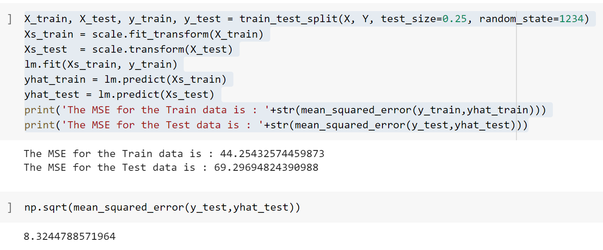

### Lab 3

# Question 1

An "ordinary least squares" (or OLS) model seeks to minimize the differences between your true and estimated dependent variable.

True. The model seeks to calculate the "least squares", or the smallest square area created between a true and an estimated variable. 
# Question 2
In a linear regression model, all feature must correlate with the noise in order to obtain a good fit.

Disagree. All features don't have to correlate with the noise in order to obtain a good fit. Rather, they shouldcorrelate with the dependent variable or other features.
# Question 3

# Question 4
In practice we determine the weights for linear regression with the "X_test" data.

False. The weigths are arbitrarily taken then reduced using the cost function until they create a line of best fit.
# Question 5
Polynomial regression is best suited for functional relationships that are non-linear in weights.

False, Polynomial regression is best suited for functional relationships that are non-linear in FEATURE VARIABLES(x^2)
# Question 6
Linear regression, multiple linear regression, and polynomial regression can be all fit using LinearRegression() from the sklearn.linear_model module in Python.

True, ALthough the model wouldn't be as accurate in the case of polynomial functions.
# Question 7 

# Question 8
(True/False) If we have one input variable and one output, the process of determining the line of best fit may not require the calculation of the intercept inside the gradient descent algorithm.

True, we can simply use the formula y = m * x + b

# Question 9 
For the line of regression in the case of the example we discussed with the 'mtcars' data set the meaning of the intercept is "no interperable meaning", because there is no x-intercept.

# Question 10
The slope of the regression line always remains the same if we scale the data by z-scores.
False.
