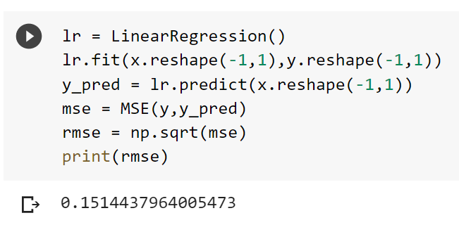
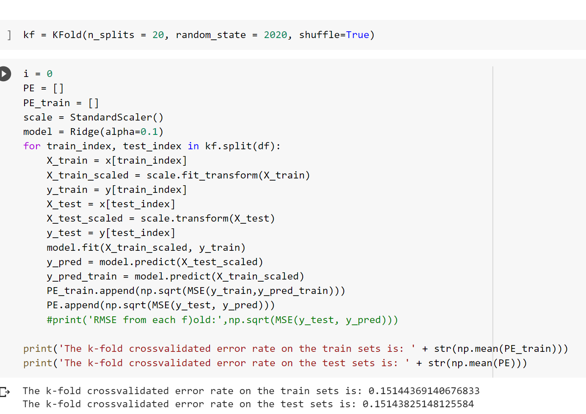
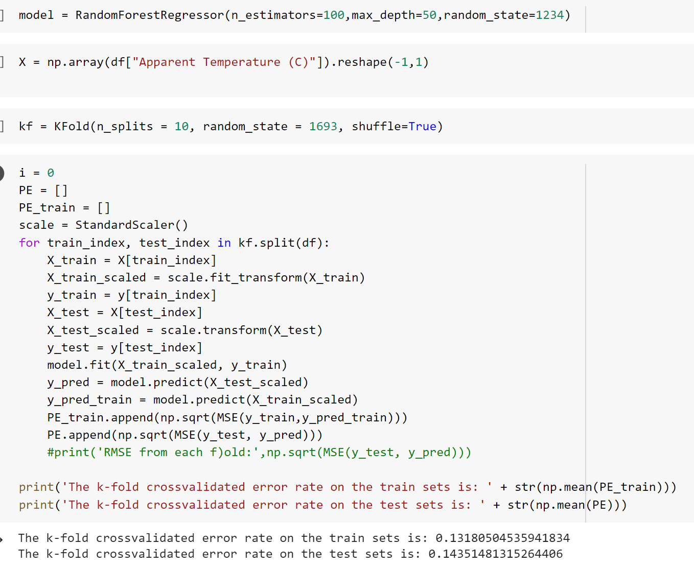
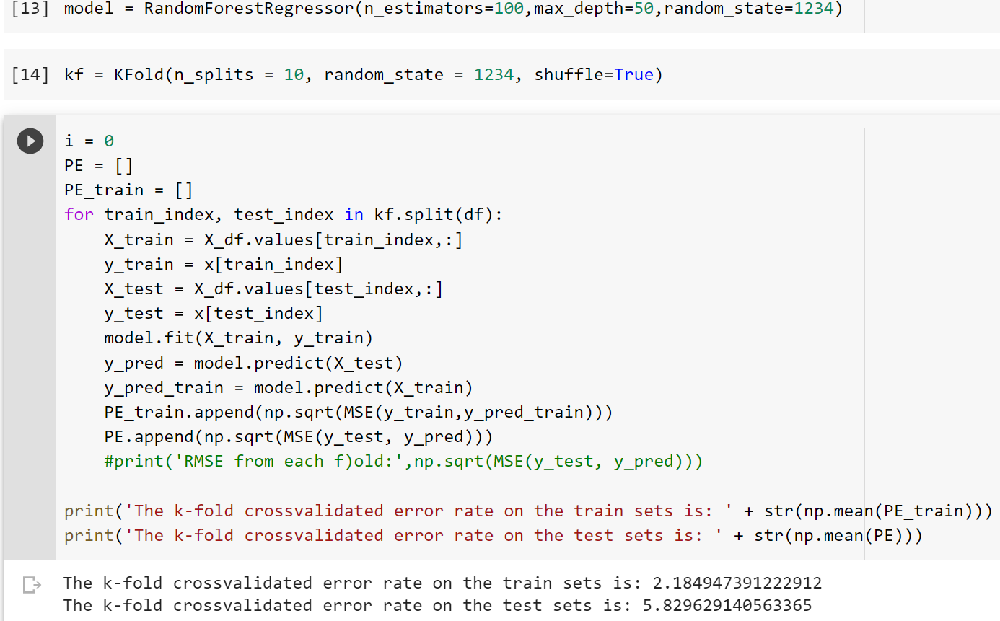

### Midterm

# Question 1

Import the weatherHistory.csv into a data frame. How many observations do we have? 

96453
# Question 2
In the weatherHistory.csv data how many features are just nominal variables?

3: "Summary", "Precip Type", and "Daily Summary"
# Question 3

# Question 4

# Question 5

# Question 6

# Question 7 

# Question 8

# Question 9 

# Question 10
If we visualize a scatter plot for Temperature (on the horizontal axis) vs Humidity (on the vertical axis) the overall trend seems to be 

decreasing

