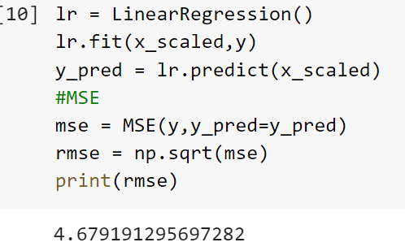
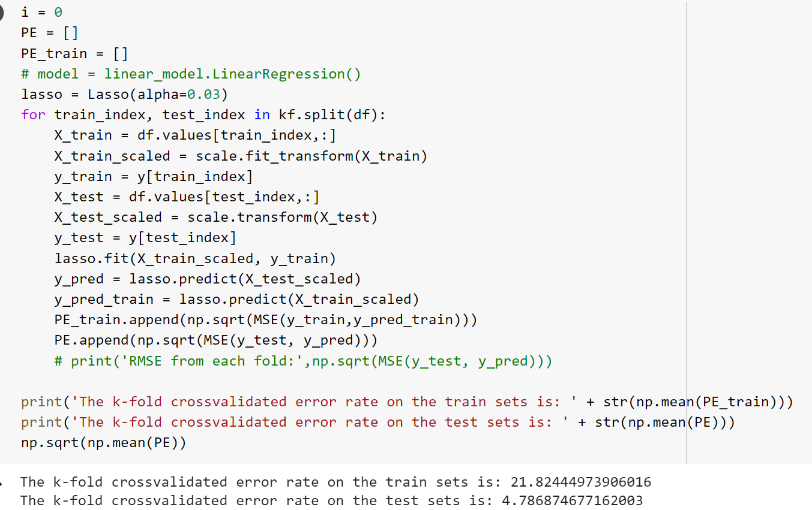
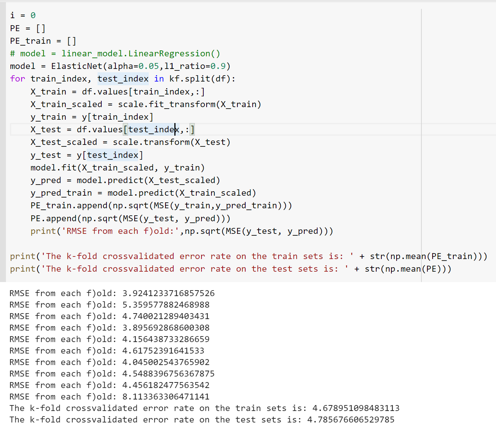
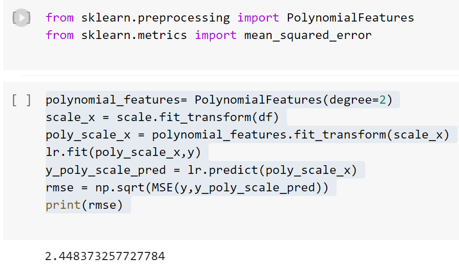

### Lab 5

# Question 1

Regularization is defined as The minimization of the sum of squared residuals subject to a constraint on the weights (aka coefficients).

# Question 2
The regularization with the square of an L2 distance may improve the results compared to OLS when the number of features is higher than the number of observations.

True, 
# Question 3
The L1 norm always yields shorter distances compared to the Euclidean norm. 

False
# Question 4
Typically, the regularization is achieved by
minimizing the average of the squared residuals plus a penalty function whose input is the vector of coefficients.

# Question 5
A regularization method that facilitates variable selection (estimating some coefficients as zero) is Lasso

# Question 6

# Question 7 

# Question 8

# Question 9 

# Question 10
If we create all quadratic polynomial (degree=2) features based on the z-scores of the original features and then apply the Ridge regression with alpha=0.1 and we create a Quantile-Quantile plot for the residuals then the result shows that  the obtained residuals pretty much follow a normal distribution.

True

