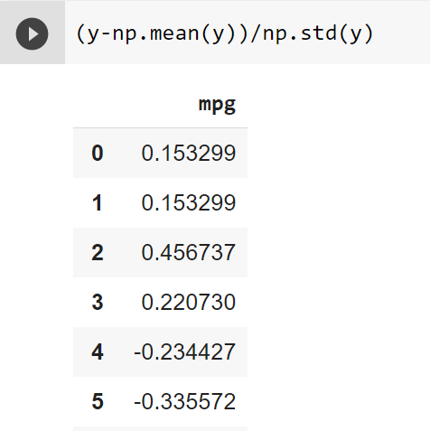
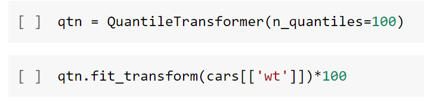
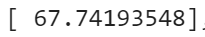
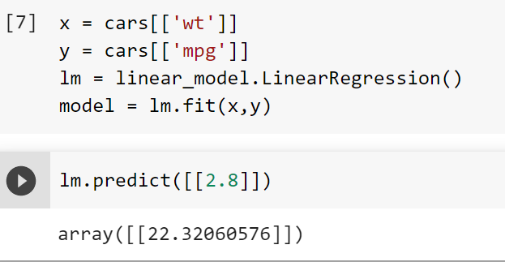
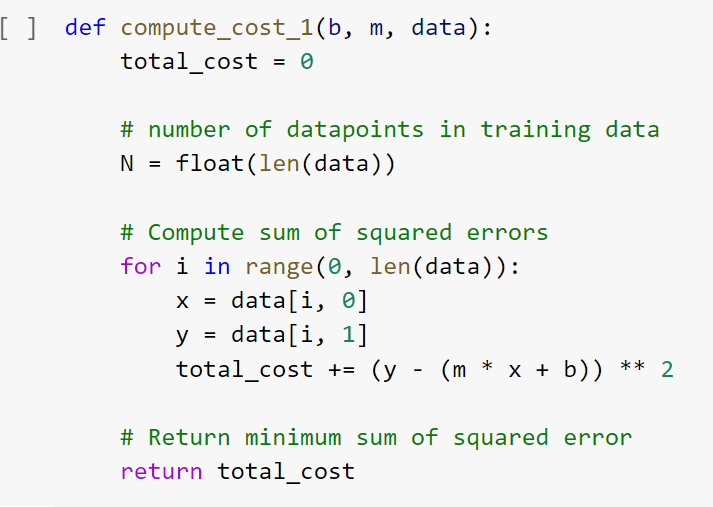

### Lab 2

# Question 1

Chebyschev's Theorem: within k standard deviations around the mean we have at least  (1−1/k^^2)%  of the population.
1 - 1/4**2 = 0.9375

# Question 2
For scaling data by quantiles we need to compute the z-scores first.

False. With quantiles, every data point is replaced by its percentile within the feature column.

# Question 3

# Question 4

# Question 5
True, a finite sum of squared quantities that depends on some parameters (weights), always has a minimum value.

# Question 6

# Question 7 

# Question 8
(True/False) If we have one input variable and one output, the process of determining the line of best fit may not require the calculation of the intercept inside the gradient descent algorithm.

True, we can simply use the formula y = m * x + b

# Question 9 
For the line of regression in the case of the example we discussed with the 'mtcars' data set the meaning of the intercept is "no interperable meaning", because there is no x-intercept.

# Question 10
The slope of the regression line always remains the same if we scale the data by z-scores.
False.
